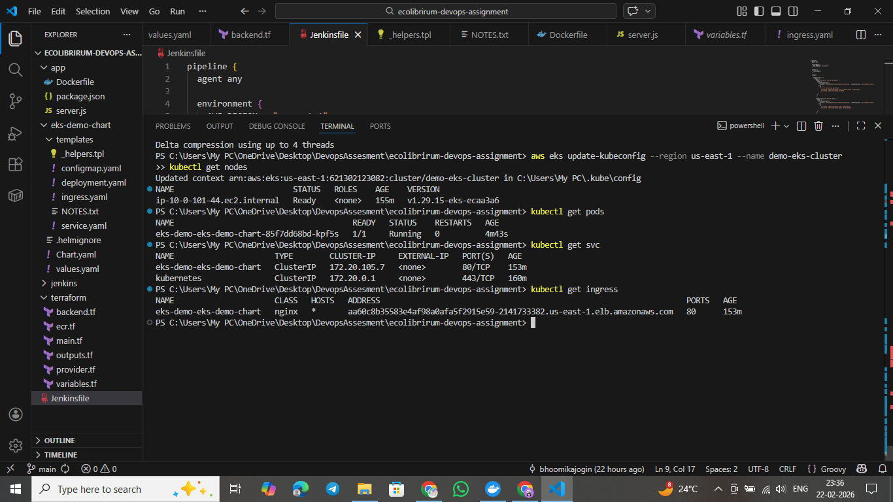

# EKS DevOps Assignment — Ecolibrium

A fully automated DevOps pipeline that provisions AWS infrastructure, builds and pushes a Docker image, and deploys a web application to Kubernetes — all triggered by a single **"Build Now"** click in Jenkins.

---

## Table Of Contents

- [Architecture Overview](#architecture-overview)
- [Repository Structure](#repository-structure)
- [Prerequisites](#prerequisites)
- [Part 1 — Jenkins Setup](#part-1--jenkins-setup)
- [Part 2 — AWS Credentials Configuration](#part-2--aws-credentials-configuration)
- [Part 3 — Pipeline Execution](#part-3--pipeline-execution)
- [Infrastructure (Terraform)](#infrastructure-terraform)
- [Application](#application)
- [Helm Chart](#helm-chart)
- [Pipeline Stages](#pipeline-stages)
- [Accessing The Application](#accessing-the-application)
- [Screenshots](#screenshots)

---

## Architecture Overview

```
Developer Push
      │
      ▼
 GitHub Repo
      │
      ▼
 Jenkins Pipeline
  ├── Terraform → Provisions VPC, EKS, IAM, NAT Gateway
  ├── Docker Build → Builds Node.js app image
  ├── ECR Push → Pushes image to AWS ECR
  ├── Ingress Controller → Installs nginx ingress on EKS
  └── Helm Deploy → Deploys app to EKS cluster
      │
      ▼
 AWS EKS Cluster
  └── App accessible via Load Balancer URL
```

---

## Repository Structure

```
ecolibrirum-devops-assignment/
├── app/
│   ├── server.js          # Node.js Express application
│   ├── package.json
│   └── Dockerfile
├── terraform/
│   ├── main.tf            # VPC, EKS, IAM, networking
│   ├── variables.tf
│   ├── outputs.tf
│   └── backend.tf         # S3 remote state + DynamoDB locking
├── eks-demo-chart/        # Custom Helm chart
│   ├── Chart.yaml
│   ├── values.yaml
│   └── templates/
│       ├── deployment.yaml
│       ├── service.yaml
│       ├── ingress.yaml
│       ├── configmap.yaml
│       ├── _helpers.tpl
│       └── NOTES.txt
├── jenkins/
│   └── Dockerfile         # Custom Jenkins image with all tools pre-installed
└── Jenkinsfile            # Full CI/CD pipeline definition
```

---

## Prerequisites

Before running the pipeline, ensure the following are available:

- AWS account with permissions for EKS, EC2, IAM, S3, ECR, DynamoDB
- S3 bucket for Terraform state: `ecolibrium-my-terraform-state-1`
- DynamoDB table for state locking: `terraform-locks`
- Docker installed on the machine running Jenkins
- Jenkins running locally via Docker (see below)

---

## Part 1 — Jenkins Setup

Jenkins runs locally as a Docker container using a custom image that has all required tools pre-installed:

- Terraform
- kubectl
- Helm
- AWS CLI v2
- Docker CLI

### Build The Custom Jenkins Image

```bash
docker build -t custom-jenkins:eks ./jenkins/
```

### Run Jenkins Container

```bash
docker run -d --name jenkins \
  -p 8080:8080 \
  -p 50000:50000 \
  -v jenkins_home:/var/jenkins_home \
  -v /var/run/docker.sock:/var/run/docker.sock \
  custom-jenkins:eks
```

> The Docker socket is mounted so Jenkins can build and push Docker images from inside the container.

### Fix Docker Socket Permissions

After starting the container, run this once to allow Jenkins to access Docker:

```bash
docker exec -u root jenkins chmod 666 /var/run/docker.sock
```

> Note: This needs to be re-applied if the container is restarted.

### Access Jenkins

Open your browser and navigate to:
```
http://localhost:8080
```

Retrieve the initial admin password:
```bash
docker exec jenkins cat /var/jenkins_home/secrets/initialAdminPassword
```

Complete the setup wizard and install suggested plugins.

---

## Part 2 — AWS Credentials Configuration

The pipeline uses AWS credentials stored securely in Jenkins.

### Add AWS Credentials In Jenkins

1. Go to **Jenkins → Manage Jenkins → Credentials → System → Global credentials**
2. Click **Add Credentials**
3. Kind: `AWS Credentials`
4. ID: `aws-sandbox-creds`
5. Enter your **AWS Access Key ID** and **Secret Access Key**
6. Click **Save**

> All pipeline stages that interact with AWS or EKS use these credentials via `withCredentials`.

---

## Part 3 — Pipeline Execution

### Create The Pipeline Job

1. Go to **Jenkins → New Item**
2. Enter a name, select **Pipeline**, click OK
3. Under **Pipeline**, select **Pipeline script from SCM**
4. SCM: **Git**
5. Repository URL: your GitHub repo URL
6. Branch: `main`
7. Script Path: `Jenkinsfile`
8. Click **Save**

### Run The Pipeline

Click **Build Now** — the pipeline will automatically:

1. Checkout code from GitHub
2. Provision AWS infrastructure via Terraform
3. Build the Docker image
4. Push it to ECR
5. Install the nginx ingress controller on EKS
6. Deploy the application using Helm
7. Print the application URL in the console output

---

## Infrastructure (Terraform)

Terraform provisions the following AWS resources:

| Resource | Details |
|---|---|
| VPC | Custom VPC with CIDR block |
| Public Subnets | For NAT Gateway and Load Balancer |
| Private Subnets | EKS nodes run here |
| Internet Gateway | Outbound access for public subnets |
| NAT Gateway | Outbound access for private subnets |
| EKS Cluster | Kubernetes cluster in private subnets |
| Managed Node Group | Worker nodes for the cluster |
| IAM Roles | Cluster and node group roles with required policies |

**Remote State:**

Terraform state is stored remotely in S3 with DynamoDB locking to support safe concurrent pipeline runs. See `terraform/backend.tf` for full configuration.

---

## Application

A lightweight Node.js Express app that serves a UI dashboard showing deployment info.

**Endpoints:**

| Endpoint | Description |
|---|---|
| `GET /` | HTML dashboard UI |
| `GET /api` | JSON response with message, stack, hostname |
| `GET /health` | Health check — returns `200 OK` |

**Environment Variables (configured via Helm values.yaml):**

| Variable | Value |
|---|---|
| `MESSAGE` | `Automating Infrastructure. Delivering Reliability.` |
| `STACK` | `DevOps Engineer · AWS · EKS · Helm · Jenkins` |
| `PORT` | `3000` |

---

## Helm Chart

A fully custom Helm chart located in `eks-demo-chart/` with the following templates:

| Template | Purpose |
|---|---|
| `deployment.yaml` | Deploys the app with env vars, volume mounts, probes |
| `service.yaml` | ClusterIP service exposing port 80 → 3000 |
| `ingress.yaml` | nginx ingress with load balancer |
| `configmap.yaml` | Mounts app config at `/app/config` |

**Key values in `values.yaml`:**

All configurable values like image repository, service ports, ingress settings, and probe paths are defined in `eks-demo-chart/values.yaml` and overridden at deploy time via `--set` flags in the Jenkins pipeline.

---

## Pipeline Stages

| Stage | What It Does |
|---|---|
| Checkout | Pulls latest code from GitHub |
| Terraform Init | Initialises backend, clears cache |
| Terraform Validate | Validates HCL syntax |
| Terraform Plan | Shows planned infrastructure changes |
| Terraform Apply | Provisions/updates AWS infrastructure |
| Docker Build | Builds app image tagged with build number |
| ECR Login | Authenticates Docker to AWS ECR |
| Docker Push | Pushes image with build number and latest tag |
| Install Ingress Controller | Installs nginx ingress controller via Helm |
| Helm Deploy | Deploys app to EKS, prints live URL |

---

## Accessing The Application

After a successful pipeline run, the application URL is printed in the Jenkins console output:

```
=========================================
Application URL: http://<load-balancer-hostname>
=========================================
```

You can also retrieve it manually:

```bash
kubectl get ingress
```

---

## Screenshots

### Jenkins Pipeline — Successful Run


### Application URL — Console Output


### Application UI


### kubectl Output
